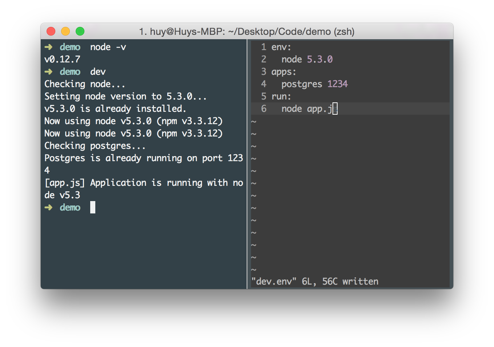

# dev.env

**dev.env** is a **Zero Setup Development Environment**.

What it does it exactly what it named, help you quickly create a development environment with no setup required - **dev.env** will setup and start everything for you.



## What platform now supported?
Currently, only `Mac OS X` has been tested. Please help me check it on `Linux` and `Windows`

## How to install

To install **dev.env**, you can clone this repository to your local machine:

```
git clone https://github.com/nmthuong/env
```

Then run `install.sh`:

```
./install.sh
```

## How to use?

First, in your new project folder, create `dev.env` file, to define everything needed for your dev stack:

```
touch dev.env
```

For example, your dev stack needed:
- Node v5.3.0
- MongoDB running on port 1234
- Redis running on port 3214
- You will run `app.js`

So your `dev.env` file should be:

```
env:
  node 5.3.0
apps:
  mongo 1234
  redis 3214
run:
  node app.js
```

When you are start to dev, just run:

```
dev
```

## What the heck is dev.env file?
`dev.env` is a configuration file that define your dev stack, there are 3 main sections in this file:
- `env`: define the environment you need to run the application
- `apps`: define the applications needed to start before running your app
- `run`: the scripts in this section will run after previous sections started

Environment is kind of version manager. Currently, `dev.env` support 2 environments: `node` and `ruby`, but it doesn't mean you can't run `java` or `python` dev stack with `dev.env`. Just try!!

For Applications, we now have:
- MongoDB
- Redis
- PostgresSQL

## How to add new environment

Please check the code in `env` folder for more detail. You can add new environment by adding new file in this folder.

For example, you may want to add `go.sh` for **Golang**, or `python.sh` for **Python**, this new script will check if your current machine already has this language installed or not, if you, it will download and install that language, then activate it in your environment.

The file name will be the environment name that you put in `dev.env` file.

Remember to implement all 3 functions:
- `check()`: for checking if current developing machine already has this environment or not
- `install()`: for installing the missing environment if needed
- `active()`: for activating current environment

## How to add new application

Same as environment, you can add new application (for example: `rethinkDB`, `couchdb`, `mysql` or `nginx`, `apache`,...)

Add new file in `apps` folder for new application. See the pre-installed applications file for the implementation.

Application file also have 3 functions:
- `check()`: check if current developing machine already has this application or not
- `install()`: download and install the application, recommend using `brew`
- `active()`: start the application, need to run as daemon to not blocking the `run` script

## How can I contribute?

Yeah! Glad you asked. My code isn't cool yet, I know it!

If you can fix it, or you want to integrate new `apps`, or new `env`, feel free to create a new _Pull request_. If you can't code, but still want to help, you can help me review on mine or other code.

Or even fix my typos :sweat_smile:

## License

This project published under **MIT License**. Please see `LICENSE.md` for more detail.
